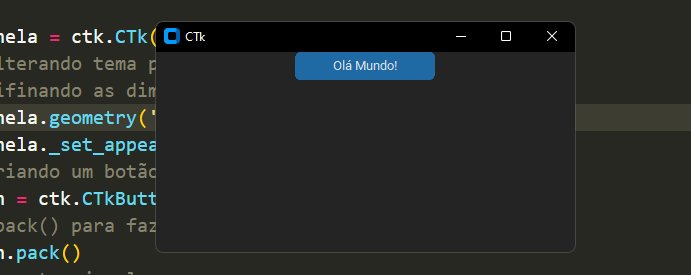

# O que aprendi na primeira aula foi, instalar a biblioteca customizada chamada customkinter.
depois, criei a janela, e um botão com o nome de 'Olá Mundo!'.

print da minha primeira janela em execução:

