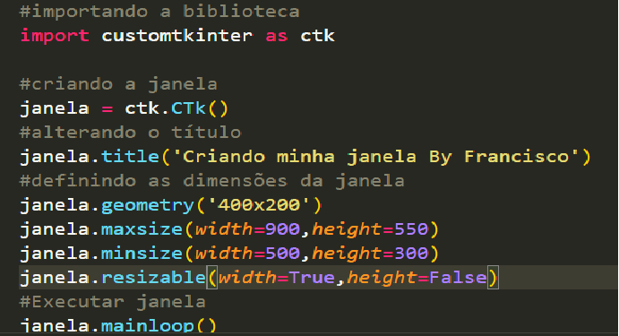

# O que aprendi na primeira aula foi, instalar a biblioteca customizada chamada customkinter.
depois, criei a janela, e um botão com o nome de 'Olá Mundo!'.

print da minha primeira janela em execução:

# Aula 2 
Aprendi a definir as dimensões máximas e mínimas da janela

Na Aula 4 aprendi a criar uma nova Janela e custumiza-la com cores e bordas

